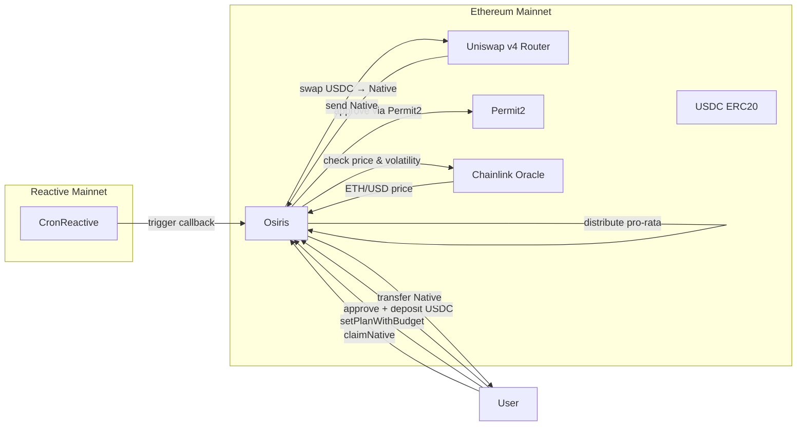
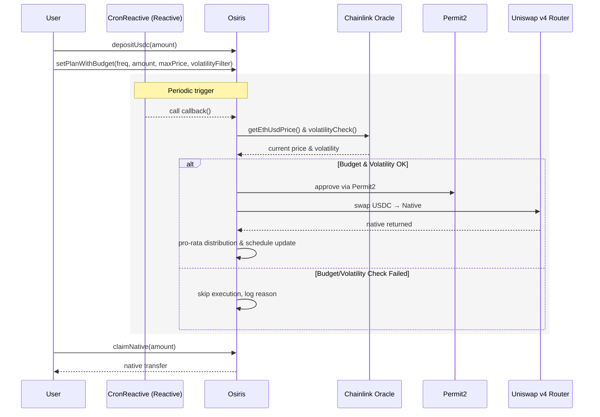

# OSIRIS

OSIRIS is a pooled smart contract executing Dollar-Cost Averaging (DCA) from USDC to the native token via Uniswap v4.  
Users deposit USDC, configure a plan (frequency + amount per period), and CronReactive (Reactive Network) periodically triggers the vault callback on Ethereum.

🌐 **[Try Osiris DApp](https://osiris-flax.vercel.app/)**

---

## Project Structure

This is a monorepo containing multiple packages:

```
OSIRIS/
├── packages/
│   ├── smart-contract/    # Solidity smart contracts (Foundry project)
│   └── front/            # Frontend application
├── .gitignore            # Git ignore rules
├── .gitmodules          # Git submodules configuration
└── README.md            # This file
```

The smart contract package contains the core Osiris DCA logic and related contracts.

---

## Overview

- **Deposit**: Each user credits their internal USDC balance.  
- **Plan**: Defines frequency (Daily / Weekly / Monthly), amount per period, budget limits, and volatility filtering.  
- **Budget Protection**: Users can set maximum USD price per ETH they're willing to pay.  
- **Volatility Filtering**: Optional protection against executing DCA during high market volatility.  
- **Execution**: The callback() aggregates eligible users, performs a single USDC → Native swap, and distributes the output pro-rata.  
- **Claim**: Users call claimNative(amount) to receive their native tokens.  
- **Pause/Resume**: Users can suspend or resume their plan without losing history or balances.

---

## Networks

- **Reactive Mainnet**: CronReactive triggers the Osiris callback.
- **Ethereum Mainnet**: Osiris contract, Uniswap v4 Router, Permit2, USDC, ETH, Chainlink price feeds.

---

## Deployed Testnet Addresses

See addresses in `packages/front/src/config/contracts.ts`:

- **Sepolia Testnet**:
  - Osiris Contract: [`0xFC2146736ee72A1c5057e2b914Ed27339F1fe9c7`](https://sepolia.etherscan.io/address/0xFC2146736ee72A1c5057e2b914Ed27339F1fe9c7)
  - Reactive Cron Contract: [`0xc14Ce8A395c2Bfd73977277eC3e8bDF584912F56`](https://lasna.reactscan.net/address/0x5104f76bce6e34f89227c6c570e61d06186b5724/contract/0xc14ce8a395c2bfd73977277ec3e8bdf584912f56)

### Testing Setup

To test the application, you need to deposit USDC into the vault. Get testnet USDC tokens using the Circle faucet:

🔗 **[Circle Testnet Faucet](https://faucet.circle.com/)**

The faucet provides 10 USDC per hour per address per hours

---

## Mainnet Deployment

### Ethereum Mainnet Addresses

- **Ethereum Mainnet**:
  - Osiris Contract: [`0x5060963F11B2c4d95bB5e0bFcf52e76b1fb2aD56`](https://arbiscan.io/address/0x5060963F11B2c4d95bB5e0bFcf52e76b1fb2aD56)
  - Reactive Cron Contract: [`0x43b13636B59f9Dc05687Ac0CcDe2761707d3cD1d`](https://reactscan.net/address/0x31710397796a5fb5773c68de8ec104fe8bce0c23/contract/0x43b13636b59f9dc05687ac0ccde2761707d3cd1d?screen=transactions)

### Getting Started on Mainnet

To use Osiris on mainnet:

1. **Buy USDC**: Use [Uniswap](https://app.uniswap.org/) to swap ETH for USDC tokens
2. **Use the DApp**: Visit the Osiris DApp at [https://osiris-flax.vercel.app/](https://osiris-flax.vercel.app/) to:
   - Deposit USDC into the Osiris vault
   - Configure your DCA plan (frequency and amount per period)
   - Manage your deposits and withdrawals

---

## Main API (Osiris contract)

### User Actions

- `depositUsdc(amount)`: Deposit USDC (requires prior approval).  
- `withdrawUsdc(amount)`: Withdraw USDC from internal balance.  
- `claimNative(amount)`: Claim accumulated native tokens.  

### Plan Management

- `setPlanWithBudget(freq, amountPerPeriod, maxBudgetPerExecution, enableVolatilityFilter)`: Create or update a DCA plan with budget and volatility controls.
- `pausePlan()`: Pause a plan (disables execution).  
- `resumePlan()`: Resume a plan (reschedules next execution).  

### System Functions

- `callback()`: Aggregates eligible users, executes the swap, distributes pro-rata.

### Price & Volatility Queries

- `getCurrentEthUsdPrice()`: Get current ETH/USD price from Chainlink.
- `getCurrentVolatility()`: Get current market volatility.
- `getVolatilityThreshold()`: Get volatility threshold setting.

---

## Smart Contract Development (Foundry)

### Prerequisites

```bash
curl -L https://foundry.paradigm.xyz | bash
foundryup
```

### Getting Started

1. Navigate to the smart contract package:

```bash
cd packages/smart-contract
```

2. Install dependencies:

```bash
forge install
```

3. Build:

```bash
forge build
```

4. Run tests:

```bash
forge test -vv
```

5. Run unit tests with gas reporting:

```bash
make test-unit
```

6. Coverage:

```bash
forge coverage
```

### Available Make Commands

From the `packages/smart-contract` directory:

- `make test-unit`: Run unit tests with gas reporting
- `make fork-sepolia`: Start local fork
- `make deploy-reactive`: Deploy CronReactive contract to Lasna
- `make deploy-osiris`: Deploy Osiris contracts
- `make pause-cron-reactive`: Pause CronReactive contract
- `make unpause-cron-reactive`: Unpause CronReactive contract

All useful addresses are stored in `config/config.json` and are automatically read by the scripts.

---

## Flow Chart



## Execution Sequence


