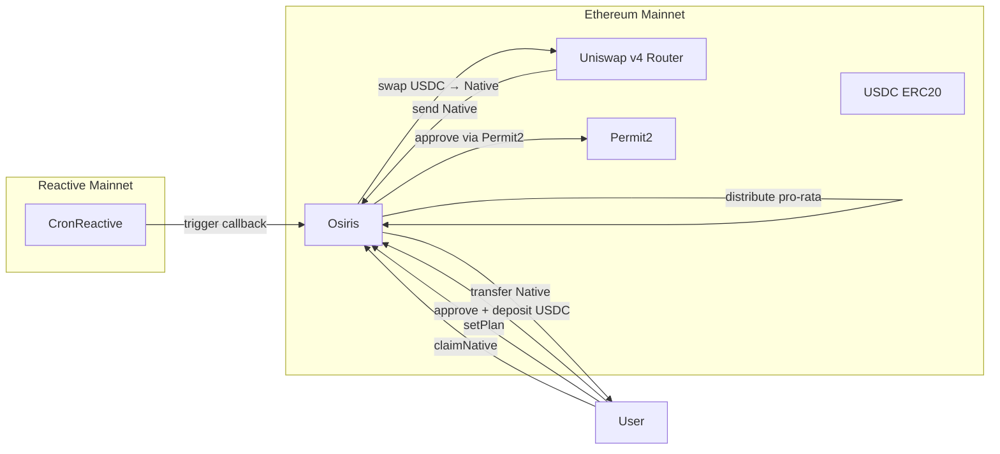
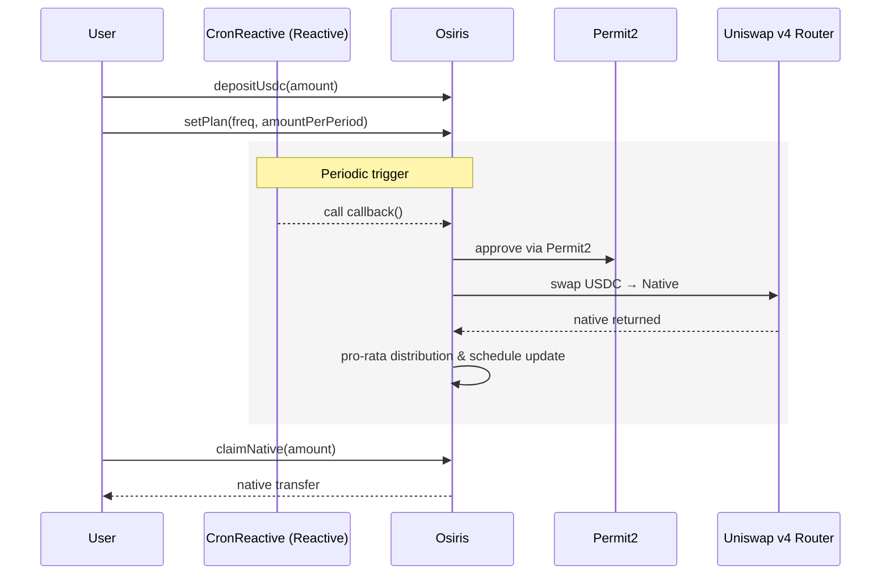

# OSIRIS

OSIRIS is a pooled smart contract executing Dollar-Cost Averaging (DCA) from USDC to the native token via Uniswap v4.  
Users deposit USDC, configure a plan (frequency + amount per period), and CronReactive (Reactive Network) periodically triggers the vault callback on Ethereum.

---

## Project Structure

This is a monorepo containing multiple packages:

```
OSIRIS/
├── packages/
│   ├── smart-contract/    # Solidity smart contracts (Foundry project)
│   └── front/            # Frontend application
├── .gitignore            # Git ignore rules
├── .gitmodules          # Git submodules configuration
└── README.md            # This file
```

The smart contract package contains the core Osiris DCA logic and related contracts.

---

## Overview

- Deposit: Each user credits their internal USDC balance.  
- Plan: Defines frequency (Daily / Weekly / Monthly) and amount per period.  
- Execution: The callback() aggregates eligible users, performs a single USDC → Native swap, and distributes the output pro-rata.  
- Claim: Users call claimNative(amount) to receive their native tokens.  
- Pause/Resume: Users can suspend or resume their plan without losing history or balances.

---

## Networks

- Reactive Mainnet: CronReactive triggers the Osiris callback.
- Ethereum Mainnet: Osiris contract, Uniswap v4 Router, Permit2, USDC, ETH.

---

## Main API (Osiris contract)

- `depositUsdc(amount)`: Deposit USDC (requires prior approval).  
- `withdrawUsdc(amount)`: Withdraw USDC from internal balance.  
- `setPlan(freq, amountPerPeriod)`: Create or update a DCA plan.  
- `pausePlan()`: Pause a plan (disables execution).  
- `resumePlan()`: Resume a plan (reschedules next execution).  
- `claimNative(amount)`: Claim accumulated native tokens.  
- `callback()`: Aggregates eligible users, executes the swap, distributes pro-rata.

---

## Smart Contract Development (Foundry)

### Prerequisites

```bash
curl -L https://foundry.paradigm.xyz | bash
foundryup
```

### Getting Started

1. Navigate to the smart contract package:

```bash
cd packages/smart-contract
```

2. Install dependencies:

```bash
forge install
```

3. Build:

```bash
forge build
```

4. Run tests:

```bash
forge test -vv
```

5. Run unit tests with gas reporting:

```bash
make test-unit
```

6. Coverage:

```bash
forge coverage
```

### Available Make Commands

From the `packages/smart-contract` directory:

- `make test-unit`: Run unit tests with gas reporting
- `make fork-sepolia`: Start local fork
- `make deploy-reactive`: Deploy CronReactive contract to Lasna
- `make deploy-osiris`: Deploy Osiris contracts
- `make pause-cron-reactive`: Pause CronReactive contract
- `make unpause-cron-reactive`: Unpause CronReactive contract

All useful addresses are stored in `config/config.json` and are automatically read by the scripts.

---

## Flow Chart



## Execution Sequence


