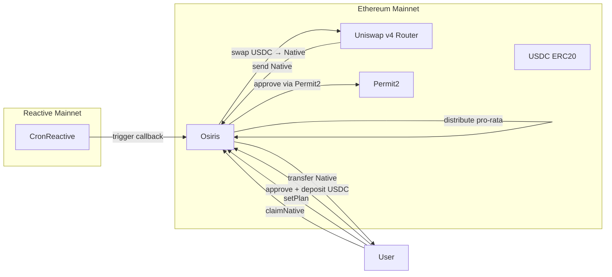
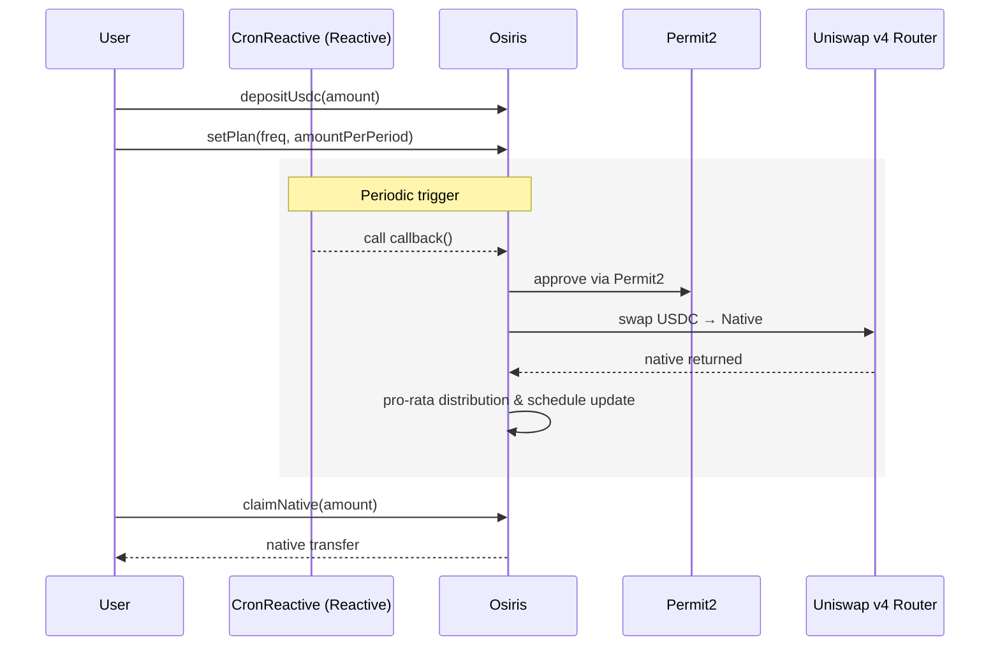

# Osiris

Osiris is a pooled smart contract executing Dollar-Cost Averaging (DCA) from USDC to the native token via Uniswap v4.  
Users deposit USDC, configure a plan (frequency + amount per period), and CronReactive (Reactive Network) periodically triggers the vault callback on Ethereum.

---

## Overview

- Deposit: Each user credits their internal USDC balance.  
- Plan: Defines frequency (Daily / Weekly / Monthly) and amount per period.  
- Execution: The callback() aggregates eligible users, performs a single USDC → Native swap, and distributes the output pro-rata.  
- Claim: Users call claimNative(amount) to receive their native tokens.  
- Pause/Resume: Users can suspend or resume their plan without losing history or balances.

---

## Networks

- Reactive Mainnet: CronReactive triggers the Osiris callback.
- Ethereum Mainnet: Osiris contract, Uniswap v4 Router, Permit2, USDC, ETH.

---

## Main API (Osiris contract)

- `depositUsdc(amount)`: Deposit USDC (requires prior approval).  
- `withdrawUsdc(amount)`: Withdraw USDC from internal balance.  
- `setPlan(freq, amountPerPeriod)`: Create or update a DCA plan.  
- `pausePlan()`: Pause a plan (disables execution).  
- `resumePlan()`: Resume a plan (reschedules next execution).  
- `claimNative(amount)`: Claim accumulated native tokens.  
- `callback()`: Aggregates eligible users, executes the swap, distributes pro-rata.

---

## Developer Commands (Foundry)

```bash
curl -L <https://foundry.paradigm.xyz> | bash
foundryup
```

- Install dependencies:

```bash
forge install
```

- Build:

```bash
forge build
```

- Run tests (unit + fuzz):

```bash
forge test -vv
```

- Coverage:

```bash
forge coverage
```

- Gas report:

```bash
forge test --gas-report
```

If a Makefile is provided:

- Run unit tests:

```bash
make test-unit
```

Useful variables (e.g., in scripts): addresses for Uniswap v4 Router, Permit2, USDC per network.

---

## Flow Chart



## Execution Sequence



    end

    U->>V: claimNative(amount)
    V-->>U: transfer Native

```
